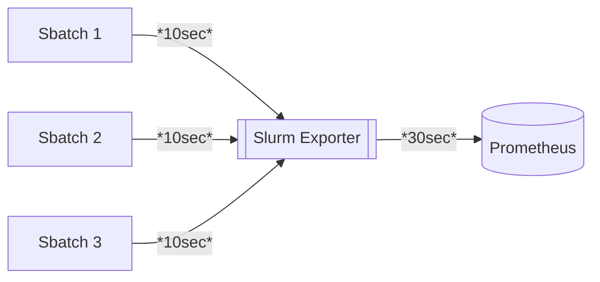

<!--
SPDX-FileCopyrightText: 2023 Rivos Inc.

SPDX-License-Identifier: Apache-2.0
-->

# Slurm Exporter

[](https://api.reuse.software/info/github.com/rivosinc/prometheus-slurm-exporter)
[](https://goreportcard.com/report/github.com/rivosinc/prometheus-slurm-exporter)

Inspired by the now unmaintained prometheus slurm [exporter](https://github.com/vpenso/prometheus-slurm-exporter). We implement in some form or another, most of the
metrics from the previously maintained exporter. We have not yet added GPU or fairshare support, although we will be more than happy to accept contributions for those.
This exporter supports `--json` output from cli. Note that the plugin supported is `openapi/v0.0.37` not `data_parser`, which ships with the most modern version of slurm.
While in production we've found that the cli fallback (defining a custom json format from the slurm cmdline) performs far better and more reliably than parsing with the slurm
provided json output. Thus, this is now the default mode of deployment as it also doesn't require any compiled plugins. We are keeping the openapi support for slurmrestd
support in the future. We also support client-side throttling. In practice, users can have multiple prometheus instances polling the same exporter without worrying about
overwhelming slurmctld. The final addition we've added is tracing support. If enabled, users can publish process stats for their jobs and track alloc vs live usage for
profiling and optimization consideration.

### Getting Started

Golang >=20 is required. From there, follow the `justfile` or run `just prod` to start a dev server.
You can also install the exporter directly with `go install github.com/rivosinc/prometheus-slurm-exporter@latest`. Then you can run `prometheus-slurm-exporter -h`.

```bash
# example installation
$ go install github.com/rivosinc/prometheus-slurm-exporter@v1.6.1
# or if you like living on the edge
$ go install github.com/rivosinc/prometheus-slurm-exporter@latest
# if not already added, ensure
$ export PATH="$PATH:$GOPATH/bin"
$ prometheus-slurm-exporter -h
...
# probably the most common invocation
$ prometheus-slurm-exporter -slurm.cli-fallback
```

Example prometheus config:

```yaml
  - job_name: 'slurm-prod-scraper'
    scrape_interval: 30s # For the best experience, this should be at least 2x POLL_LIMIT
    scrape_timeout: 30s
    static_configs:
        - targets: ['path.to.exporter:9092']
```

We've also uploaded a example [dashboard](https://grafana.com/grafana/dashboards/19835-slurm-dashboardv2) to help users get started. If the link doesn't work try import by Id: `19835`

### Job Tracing

Job tracing is default disabled. To enable it simply add `-trace.enabled` to the arg list. This will enable endpoint `/trace` by default (configurable, see help page).
With trace enabled jobs can _POST_ process metrics to the exporter. This adds a memory overhead that is proportional to the amount of jobs enabled for tracing.
When writing wrapper scripts to upload job data, ensure that they publish data in a json schema that the exporter can understand and that it uploads proc info at a rate thats faster than the prometheus scrape time (I recommend 2x the prometheus scrape interval). Wrapped jobs can now be traced on Grafana so users can see job resource usage
alongside a jobs allocated resources. Here is an example wrapper script:

```bash
#!/bin/bash

#SBATCH -p <partition>
#SBATCH ...other options

module load python3

export SLURM_EXPORTER=http://path.to.exporter:8092/trace
export SAMPLE_RATE=5

python3 ./wrappers/proctrac.py $@
```

We can then get dispatch jobs with our wrapper script as such `sbatch srun_wrapper.sh sleep 300`. With tracing enabled, we get the following visualization.


Feel free to write your own wrappers. To use ours, ensure slurm nodes have access to `pip3 install psutil requests`. Currently, we do not plan to support any auth modes between the wrappers and the exporter, although contributions are welcome.
Here is the trace architecture:


### Available Metrics

```bash
$ curl localhost:9092/metrics | grep "# HELP"
# HELP process_cpu_seconds_total Total user and system CPU time spent in seconds.
# HELP process_max_fds Maximum number of open file descriptors.
# HELP process_open_fds Number of open file descriptors.
# HELP process_resident_memory_bytes Resident memory size in bytes.
# HELP process_start_time_seconds Start time of the process since unix epoch in seconds.
# HELP process_virtual_memory_bytes Virtual memory size in bytes.
# HELP process_virtual_memory_max_bytes Maximum amount of virtual memory available in bytes.
# HELP promhttp_metric_handler_requests_in_flight Current number of scrapes being served.
# HELP promhttp_metric_handler_requests_total Total number of scrapes by HTTP status code.
# HELP slurm_account_cpu_alloc alloc cpu consumed per account
# HELP slurm_account_job_state_total total jobs per account per job state
# HELP slurm_account_mem_alloc alloc mem consumed per account
# HELP slurm_cpu_load Total cpu load
# HELP slurm_cpus_idle Total idle cpus
# HELP slurm_cpus_per_state Cpus per state i.e alloc, mixed, draining, etc.
# HELP slurm_cpus_total Total cpus
# HELP slurm_job_scrape_duration how long the cmd [cat fixtures/squeue_out.json] took (ms)
# HELP slurm_job_scrape_error slurm job scrape error
# HELP slurm_mem_alloc Total alloc mem
# HELP slurm_mem_free Total free mem
# HELP slurm_mem_real Total real mem
# HELP slurm_node_scrape_duration how long the cmd [cat fixtures/sinfo_out.json] took (ms)
# HELP slurm_node_scrape_error slurm node info scrape errors
# HELP slurm_partition_alloc_cpus Alloc cpus per partition
# HELP slurm_partition_alloc_mem Alloc mem per partition
# HELP slurm_partition_cpu_load Total cpu load per partition
# HELP slurm_partition_idle_cpus Idle cpus per partition
# HELP slurm_partition_job_state_total total jobs per partition per state
# HELP slurm_partition_real_mem Real mem per partition
# HELP slurm_partition_total_cpus Total cpus per partition
# HELP slurm_partition_weight Total node weight per partition??
# HELP slurm_user_cpu_alloc total cpu alloc per user
# HELP slurm_user_mem_alloc total mem alloc per user
# HELP slurm_user_state_total total jobs per state per user
# HELP slurm_node_count_per_state nodes per state

# Only available for -trace.enabled jobs
# HELP slurm_proc_cpu_usage actual cpu usage collected from proc monitor
# HELP slurm_proc_mem_usage proc mem usage
# HELP slurm_proc_pid pid of running slurm job
# HELP slurm_proc_read_bytes proc read bytes
# HELP slurm_proc_threadcount threads currently being used
# HELP slurm_proc_write_bytes proc write bytes
# HELP slurm_job_cpu_alloc running job cpus allocated
# HELP slurm_job_mem_alloc running job cpus allocated

# Exporter stats
# HELP slurm_node_count_per_state nodes per state
# HELP slurm_node_scrape_duration how long the cmd [<configured command>] took ms
# HELP slurm_node_scrape_error slurm node info scrape errors
# HELP slurm_job_count_per_state jobs per state
# HELP slurm_job_scrape_duration how long the cmd [<configured command>] took ms
# HELP slurm_job_scrape_error slurm job info scrape errors

```

### Exporter Env Var Docs

Env vars can be sepcified in a `.env` file, while using the `just`
| Var           | Default Value | Purpose                                                                     |
|---------------|---------------|-----------------------------------------------------------------------------|
| POLL_LIMIT    | 10            | # of seconds to wait before polling slurmctl again (client-side throttling)  |
| LOGLEVEL      | info          | Log Level: debug, info, warn, error                                         |
| CLI_TIMEOUT   | 10.           | # seconds before the exporter terminates command.                           |


### Future work
Add scheduler info, slurmrestd support, package binary into apt, rpm packages, and docker
