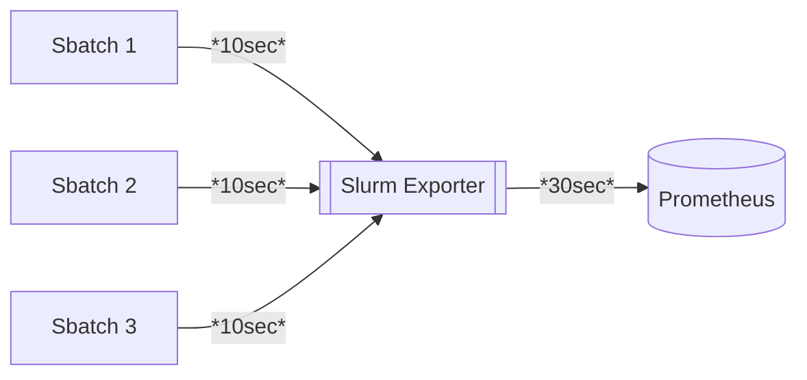

# Slurm Exporter

Inspired by the now unmaintained prometheus slurm [exporter](https://github.com/vpenso/prometheus-slurm-exporter). We implement in some form or another, most of the
metrics from the previously maintained exporter. We have not yet added GPU or fairshare support, although we will be more than happy to accept contributions for those.
This exporter uses is rewritten to use the json out put of the sinfo and squeue commands. In addition, this exporter comes with job tracing and client-side throttling

### Getting Started
Golang 20 is required. From there, follow the `justfile` or run `just prod` to start a dev server. Here is a brief overview of exporter options

```bash
Usage of ./build/slurm_exporter:
  -slurm.poll-limit float
        throttle for slurmctld (default: 10s)
  -slurm.sinfo-cli string
         (default "sinfo cli override")
  -slurm.squeue-cli string
         (default "squeue cli override")
  -trace.enabled
        Set up Post endpoint for collecting traces
  -trace.path string
        POST path to upload job proc info (default "/trace")
  -trace.rate uint
        number of seconds proc info should stay in memory before being marked as stale
  -web.listen-address string
        Address to listen on for telemetry (default: 9092)
  -web.log-level string
        Log level: info, debug, error, warning
  -web.telemetry-path string
        Path under which to expose metrics (default: /metrics)
```

### Job Tracing
Job tracing is default disabled. To enable it simply add `--trace.enabled` to the arg list. This will enable endpoint `/trace` by default (configurable, see help page).
With trace enabled jobs can _POST_ proccess metrics to the exporter. This adds a memory overhead that is proportional to the amount of jobs enabled for tracing.
When writing wrapper scripts to upload job data, ensure that they publish data in a json schema that the exporter can understand and that it uploads proc info at a rate thats faster than the prometheus scrape time (I reccomend 2x the prometheus scrape interval). Wrapped jobs can now be traced on Grafana so users can see job resource usage
alongside a jobs allocated resources. Here is an example wrapper script:

```bash
#!/bin/bash

#SBATCH -p <partition>
#SBATCH ...other options

module load python3

SLURM_EXPORTER=http://path.to.exporter:8092/trace
SAMPLE_RATE=5

python3 ./wrappers/proctrac.py $@
```

We can then get dispatch jobs with our wrapper script as such `srun/sbatch srun_wrapper.sh sleep 300`. With tracing enabled, we get the following visualization.


Feel free to write your own wrappers. To use ours, ensure slurm nodes have access to `pip3 install psutil requests`. Currently, we do not plan to support any auth modes between the wrappers and the exporter, although contributions are welcome.
Here is the trace architecture:


### Available Metrics
```bash
$ curl localhost:8092/metrics | grep "# HELP"
# HELP slurm_account_cpu_alloc alloc cpu consumed per account
# HELP slurm_account_job_state_total total jobs per account per job state
# HELP slurm_account_mem_alloc alloc mem consumed per account
# HELP slurm_cpu_load Total cpu load
# HELP slurm_cpus_idle Total idle cpus
# HELP slurm_cpus_per_state Cpus per state i.e alloc, mixed, draining, etc.
# HELP slurm_cpus_total Total cpus
# HELP slurm_mem_alloc Total alloc mem
# HELP slurm_mem_free Total free mem
# HELP slurm_mem_real Total real mem
# HELP slurm_partition_alloc_cpus Alloc cpus per partition
# HELP slurm_partition_alloc_mem Alloc mem per partition
# HELP slurm_partition_cpu_load Total cpu load per partition
# HELP slurm_partition_free_mem Free mem per partition
# HELP slurm_partition_idle_cpus Idle cpus per partition
# HELP slurm_partition_job_state_total total jobs per partition per state
# HELP slurm_partition_real_mem Real mem per partition
# HELP slurm_partition_total_cpus Total cpus per partition
# HELP slurm_partition_weight Total node weight per partition??
# HELP slurm_user_cpu_alloc total cpu alloc per user
# HELP slurm_user_mem_alloc total mem alloc per user
# HELP slurm_user_state_total total jobs per state per user

# Only available for --trace.enabled jobs
# HELP slurm_proc_cpu_usage actual cpu usage collected from proc monitor
# HELP slurm_proc_mem_usage proc mem usage
# HELP slurm_proc_pid pid of running slurm job
# HELP slurm_proc_read_bytes proc read bytes
# HELP slurm_proc_threadcount threads currently being used
# HELP slurm_proc_write_bytes proc write bytes
# HELP slurm_job_cpu_alloc running job cpus allocated
# HELP slurm_job_mem_alloc running job cpus allocated
```

### Exporter Env Var Docs

| Var        | Default Value | Purpose                                                                     |
|------------|---------------|-----------------------------------------------------------------------------|
| POLL_LIMIT | 1             | # of seconds to wait before polling slurmctl again (client-side throtting)  |
| LOGLEVEL   | info          | Log Level: debug, info, warn, error                                         |


### Future work
Add scheduler info, slurmrestd support, package binary into apt and rpm packages
